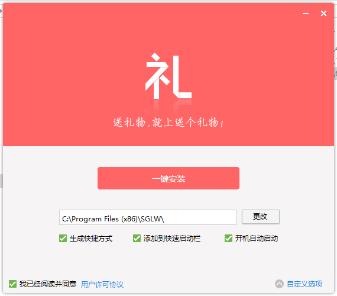
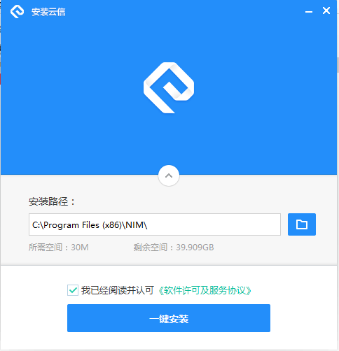

文件太大，国内的用户可以到百度网盘上下载
链接: https://pan.baidu.com/s/1smlN6Zr 密码: vzub

# NSIS-UI
NSIS封包exe，牛牛安装包界面美化控件 [nsNiuniuSkin]，包含3个实例，后两个是官网的，helloworld那个是根据上面两个例子改的。
# 说明：
1.本人是做web的，这些东西并不明白是怎么做的，只是照搬而已，请不要咨询我有关软件封包的事情，鄙人真帮不了你。 
2.项目是使用electron做的一个web网站，使用electron-packager打包。使用过electron-packager的都知道打包后其实是那种绿色版的，一大堆文件，
所以要做成安装包的形式才方便使用。刚开始是使用InnoSetup做的，制作流程和界面都比较简单是win2000风格的？觉得并不能让客户满意，所以后来搜索
软件封包界面美化就搜到了nsNiuniuSkin这个插件，使用Duilib与NSIS结合的方式实现的。当然InnoSetup也可以实现，但是咱不会啊，有现成的就用吧。
3.下面放图

